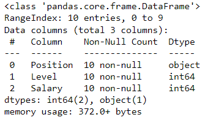
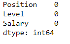
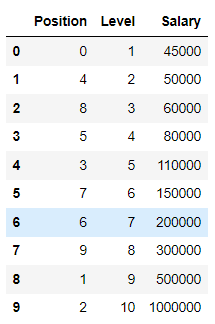
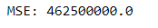
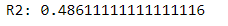
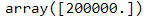

# Implementation-of-Decision-Tree-Regressor-Model-for-Predicting-the-Salary-of-the-Employee

## AIM:
To write a program to implement the Decision Tree Regressor Model for Predicting the Salary of the Employee.

## Equipments Required:
1. Hardware – PCs
2. Anaconda – Python 3.7 Installation / Jupyter notebook

## Algorithm
1. Import pandas and read the csv file.
2. Encoding the data and Import Decision tree classifier.
3. Fit the data in the model.
4. Find the MSE , r2 and the Predicted.

## Program:
```py
Program to implement the Decision Tree Regressor Model for Predicting the Salary of the Employee.
Developed by: Anish Raj P
RegisterNumber:  212222230010

import pandas as pd
df=pd.read_csv("Salary.csv")
df.head(10)
df.info()
df.isnull().sum()
from sklearn.preprocessing import LabelEncoder
le=LabelEncoder()
df['Position']=le.fit_transform(df['Position'])
df.head(10)
x=df[['Position','Level']]
y=df['Salary']
from sklearn.model_selection import train_test_split as tts
Xtrain,Xtest,Ytrain,Ytest=tts(x,y,test_size=0.2,random_state=2)
from sklearn.tree import DecisionTreeRegressor
dt=DecisionTreeRegressor()
dt.fit(Xtrain,Ytrain)
Ypred=dt.predict(Xtest)
from sklearn import metrics
mse=metrics.mean_squared_error(Ytest,Ypred)
mse
r2=metrics.r2_score(Ytest,Ypred)
r2
dt.predict([[5,6]])
```

## Output:
### df.head()

### df.info()

### df.isnull().sum()

### Label Encoded Data

### MSE

### r2

### Predicted Value


## Result:
Thus the program to implement the Decision Tree Regressor Model for Predicting the Salary of the Employee is written and verified using python programming.
